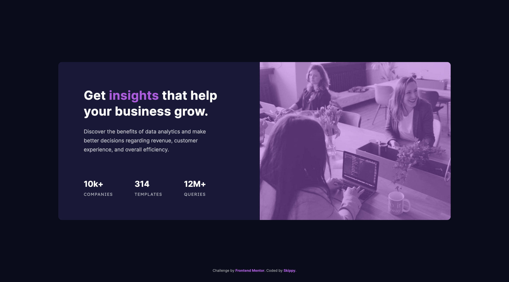

# Frontend Mentor - Stats preview card component solution

This is a solution to the [Stats preview card component challenge on Frontend Mentor](https://www.frontendmentor.io/challenges/stats-preview-card-component-8JqbgoU62). Frontend Mentor challenges help you improve your coding skills by building realistic projects.

## Table of contents

- [Overview](#overview)
  - [The challenge](#the-challenge)
  - [Screenshot](#screenshot)
  - [Links](#links)
- [My process](#my-process)
  - [Built with](#built-with)
  - [What I learned](#what-i-learned)
  - [Continued development](#continued-development)
  - [Useful resources](#useful-resources)
- [Author](#author)

## Overview

### The challenge

Users should be able to:

- View the optimal layout depending on their device's screen size

### Screenshot

### Links

- Solution URL: [Frontend Mentor](https://www.frontendmentor.io/solutions/the-stats-card-component-that-i-dont-have-a-good-feeling-about-k5speV7Ti)
- Live Site URL: [Github Pages](https://skippysworld.github.io/Stats-Preview-Card-Component/)

## My process

### Built with

- Semantic HTML5 markup
- CSS custom properties
- Flexbox

### What I learned

Okie-dokie, this took me far more time than I expected. Did I learn something? That I might always end-up cycled in my own code and get lost.

I have a feeling like this might be the worst code I've written so far. After two days I've almost gave up and I probably ended rather with hard-coded solution instead of keeping it more responsive.

Lastly I learned it's much easier to code mobile version first. 

### Continued development

I need to get more into flexbox and become more confident about it. So I don't end up with tries and fails so often.

Also I need to better understand connections between positioning and whats actually possible with it, together with using relative units and their case of use.

### Useful resources

- [A modern CSS Reset](https://piccalil.li/blog/a-modern-css-reset/) - I heard about CSS Reset templates during my online course.. There is a lot of options out there, but I've decided to start with this one.

## Author

- Frontend Mentor - [@skippysworld](https://www.frontendmentor.io/profile/skippysworld)
